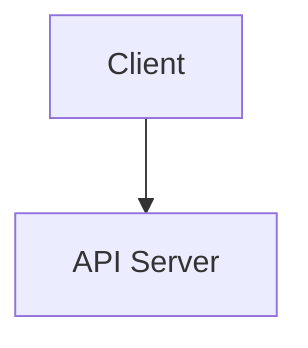

# 📋 Technical Specification: {{Project Name}}

## 1. 專案概述 (Overview)
- 

## 2. 系統架構 (Architecture)

```mermaid
graph TD
    A[Client] --> B[API Server]
```

## 3. 介面與資料結構 (Interfaces & Data Models)
- 

## 4. 關鍵技術棧 (Tech Stack)
- 
